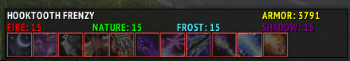

This addon is an external module for [pfUI](https://gitlab.com/shagu/pfUI) addon.

## Screenshots

## Description
Inspired by aDF addon, made with love to pfUI :) Shows mob armor, resistances and also tracks important raid debuffs. 

## Installation
**This addon will not function without [pfUI](https://gitlab.com/shagu/pfUI) installed**
1. Download **[Latest Version](https://gitlab.com/dein0s_wow_vanilla/pfUI-debuffmonitor/-/archive/master/pfUI-master.zip)**
2. Unpack the Zip file
3. Rename the folder to "pfUI-debuffmonitor"
4. Copy "pfUI-debuffmonitor" into Wow-Directory\Interface\AddOns
5. Restart WoW
# pfui-debuffmonitor
